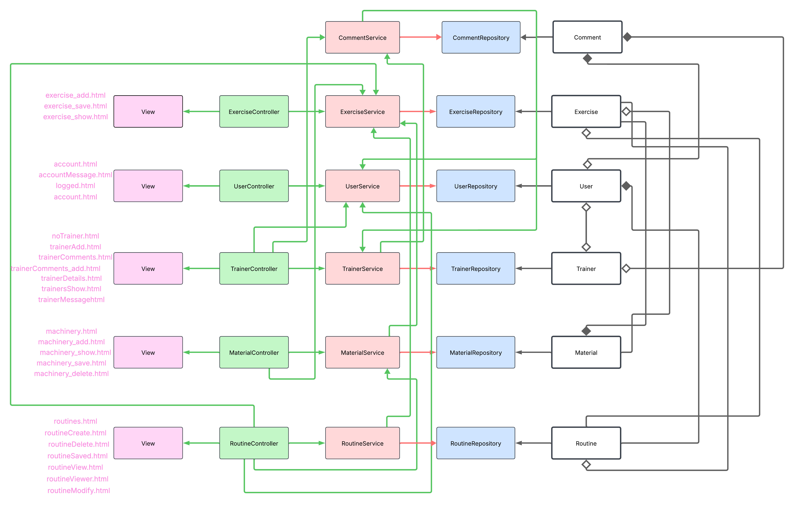

# Nombre de la aplicación: GoldenGym 🏋️


## Integrantes: 
| Name | Email | Github |
|-----------|-----------|-----------|
| Iván Fernández Ruiz    | i.fernandezru.2022@alumnos.urjc.es |[Iván-Fernández](https://github.com/ifernandezru22) |             |
| Sergio Antón Berenguer | s.anton.2022@alumnos.urjc.es | [Sergio-Antón](https://github.com/AnthonyZY13)                             |
| Andrés Korotkov Vorobey       | a.korotkov.2022@alumnos.urjc.es | [Andrés-korotkov](https://github.com/4ndresito3)              |
| Jesús Pérez Madera | j.perezm.2022@alumnos.urjc.es | [Jesús-Pérez](https://github.com/JPM1919)                             |

## Aspectos principales:
- **Entidades:** user, trainer, comment, routine, exercise, material.

   

- **Permisos de usuario:**
  - Usuario registrado: cerrar sesión, borrar cuenta, cambiar imagen de perfil, ver entrenadores, elegir entrenador, ver comentarios del entrenador, comentar entrenador, crear rutina, ver rutina, ver maquinaria, ver instalaciones.
  - Usuario no registrado: iniciar sesión, ver entrenadores, ver comentarios, ver maquinaria, ver instalaciones.
  - Administrador: permisos de usuario registrado + añadir entrenador, eliminar entrenador, añadir maquinaria y añadir ejercicios.
- **Imágenes:** foto de perfil, fotos de entrenadores y de instalaciones.

//TODO: Navigation diagram and screenshots
- ## Capturas de pantalla: 

A continuación, se muestra un recorrido por la página web con las principales páginas accesibles.
- **Página de Inicio:**
 

**Descripción**: Es la primera pantalla que ve el usuario al entrar en la página web. Desde esta pantalla puedes acceder a: Instalaciones, Maquinaria, Rutinas y Entrenadores. Además, puedes acceder a tu perfil pulsando en la foto de perfil. 

- **Pantalla registro de usuarios:**

 

**Descripción**:Para registrarse debes elegir un nombre, contraseña y una foto de perfil (opcional).

- **Página de tu Perfil:**

 

**Descripción**: En la página del perfil del usuario, se presenta las siguientes funcionalidades: Añadir/Cambiar foto de perfil, cerrar sesión, borrar cuenta y ver usuarios (si eres el administrador).

- **Página de Instalaciones:**

 

**Descripción**: Esta página muestra las diferentes localizaciones en las que se encuentran los gimnasios con información relacionada a cada una de ellas.

- **Página de Maquinaria:**

 

**Descripción**:Esta página muestra todas las maquinarias disponibles. Si eres administrador, puedes crear y borrar maquinaria.

- **Página de Rutinas:**

 

**Descripción**:En esta página tienes la opción de crear y ver tus rutinas creadas. Si eres administrador, tienes la posibilidad de crear y eliminar ejercicios.

- **Página de Entrenadores:**

 

**Descripción**: Esta página muestra todos los entrenadores disponibles. Si eres administrador, puedes añadir nuevos entrenadores.

- **Página del perfil de un entrenador:**

 

**Descripción**: Una vez pulsas en alguno de los entrenadores disponibles puedes seleccionarlo como entrenador, ver comentarios sobre la experiencia de otras personas con dicho entrenador (y añadir un comentario si has iniciado sesión).

## Diagrama de navegación: 
- **<span style="color:blue">Azul</span>:** Todos los usuarios.
- **<span style="color:yellow">Amarillo</span>:** Usuarios Registrados y administrador.
- **<span style="color:green">Verde</span>:** Administrador.
- **Nota**: Se puede llegar a index,account, machinery, facilities,routines y trainers desde cualquier página. Tambíen puedes llegar a la página de error desde cualquier página.
 

## Diagrama con las entidades de la base de datos: 
 

## Diagrama de clases y templates: 
 


## Participación
- **<span style="color:green">Jesús Pérez</span>:** 
    - Tareas: creación de clase usuario, tipos de usuario: usuario anónimo, registrado y administrador, registro e inicio de sesión de usuarios, datos de sesión, foto de perfil, borrar cuenta, ver entrenadores, crear y borrar entrenadores, asignar entrenador a usuario, creación de todos los ficheros html relacionados.
    - 5 commits más significativos:
       - 5 commits más significativos:
      - [Commit 1](https://github.com/SSDD-2025/practica-sistemas-distribuidos-2025-grupo-8/commit/ddb328f66a0b82cb62ea27a3d75131b7d790901a)
      - [Commit 2](https://github.com/SSDD-2025/practica-sistemas-distribuidos-2025-grupo-8/commit/e23c3ade23a1c499a4db317ffa583dd88390edb1)
      - [Commit 3](https://github.com/SSDD-2025/practica-sistemas-distribuidos-2025-grupo-8/commit/8cd1e25f323ce90b3cc5067d5371d4b075d23e97)
      - [Commit 4](https://github.com/SSDD-2025/practica-sistemas-distribuidos-2025-grupo-8/commit/e64c8598e3e85d0a4b4ba3c7ebedc5d42cffcd84)
      - [Commit 5](https://github.com/SSDD-2025/practica-sistemas-distribuidos-2025-grupo-8/commit/82732d9953e0a03938ec73b5fde80baa4b334bc8)
    - 5 ficheros en los que se ha participado:
      - [UserController](https://github.com/SSDD-2025/practica-sistemas-distribuidos-2025-grupo-8/blob/main/gymapp/src/main/java/es/codeurjc/gymapp/controllers/UserController.java)
      - [TrainerController](https://github.com/SSDD-2025/practica-sistemas-distribuidos-2025-grupo-8/blob/main/gymapp/src/main/java/es/codeurjc/gymapp/controllers/TrainerController.java)
      - [GlobalControllerAdvice](https://github.com/SSDD-2025/practica-sistemas-distribuidos-2025-grupo-8/blob/main/gymapp/src/main/java/es/codeurjc/gymapp/GlobalControllerAdvice.java)
      - [User](https://github.com/SSDD-2025/practica-sistemas-distribuidos-2025-grupo-8/blob/main/gymapp/src/main/java/es/codeurjc/gymapp/model/User.java)
      - [UserSession](https://github.com/SSDD-2025/practica-sistemas-distribuidos-2025-grupo-8/blob/main/gymapp/src/main/java/es/codeurjc/gymapp/model/UserSession.java)
- **<span style="color:green">Sergio Antón </span>:** 
    - Tareas: gestión de rutinas (crear, borrar y modificar), trabajo en el routineController,en el routineServices y en la entidad rutina, pequeñas aportaciones al css, refactorización de código, creación de los ficheros html relacionados con las rutinas y con su gestión.
    - 5 commits más significativos:
       - 5 commits más significativos:
      - [Commit 1](https://github.com/SSDD-2025/practica-sistemas-distribuidos-2025-grupo-8/commit/ce2ed89ad2ab75850f79414000222cf3ce1f16ba)
      - [Commit 2](https://github.com/SSDD-2025/practica-sistemas-distribuidos-2025-grupo-8/commit/6970a67bb99ae4ed7cd8995f08dd82d21f9f6a83)
      - [Commit 3](https://github.com/SSDD-2025/practica-sistemas-distribuidos-2025-grupo-8/commit/3699889086afa79d04573d241e0c949c60be8b9b)
      - [Commit 4](https://github.com/SSDD-2025/practica-sistemas-distribuidos-2025-grupo-8/commit/783765d6035a637ae58234469e856a6c5d384ff0)
      - [Commit 5](https://github.com/SSDD-2025/practica-sistemas-distribuidos-2025-grupo-8/commit/b7a063c12fa434deef75b486f3430601a9e06bc2)
    - 5 ficheros en los que se ha participado:
      - [RoutineController](https://github.com/SSDD-2025/practica-sistemas-distribuidos-2025-grupo-8/blob/main/gymapp/src/main/java/es/codeurjc/gymapp/controllers/RoutineController.java)
      - [Routine](https://github.com/SSDD-2025/practica-sistemas-distribuidos-2025-grupo-8/blob/main/gymapp/src/main/java/es/codeurjc/gymapp/model/Routine.java)
      - [RoutineService](https://github.com/SSDD-2025/practica-sistemas-distribuidos-2025-grupo-8/blob/main/gymapp/src/main/java/es/codeurjc/gymapp/services/RoutineServices.java)
      - [Routine.htmls](https://github.com/SSDD-2025/practica-sistemas-distribuidos-2025-grupo-8/tree/main/gymapp/src/main/resources/templates/routines)
      - [AdminController](https://github.com/SSDD-2025/practica-sistemas-distribuidos-2025-grupo-8/blame/main/gymapp/src/main/resources/static/style.css)
- **<span style="color:green">Noelia Berzosa</span>:** 
    - Tareas: registrar usuario, añadir ejercio adminstrador, login, paginación lista ejercios, detalles ejercicios (video, imagen), exportar rutina en PDF,lista ejercicios, buscador de ejercios, borrar ejercicio administrador, separar header, organización de código, error, diagrama navegación, diagrama clases y templates, logo en página web 
    - 5 commits más significativos:
      - [Commit 1](https://github.com/CodeURJC-DAW-2023-24/webapp08/commit/0b406a39fd00f07caa5d885a0c3210bc4ea32fe6) Muestra general de los 18 updates de diseño que ha habido
      - [Commit 2](https://github.com/CodeURJC-DAW-2023-24/webapp08/commit/c5fe4e9cd2f8e531de7774e40ce7fc7764011e0c)
      - [Commit 3](https://github.com/CodeURJC-DAW-2023-24/webapp08/commit/9e4d2be4d68205d33b8775d79a240181d71c1144)
      - [Commit 4](https://github.com/CodeURJC-DAW-2023-24/webapp08/commit/cb1c93164f592f6d42f5ccc6a0c14efdcfd6ba2c)
      - [Commit 5](https://github.com/CodeURJC-DAW-2023-24/webapp08/commit/69453116f341ed61d836047afba7d5ce61ca8578)
    - 5 ficheros en los que se ha participado:
      - [ExerciseController](https://github.com/CodeURJC-DAW-2023-24/webapp08/blob/main/demo/src/main/java/com/example/demo/controller/ExerciseController.java)
      - [PDFController](https://github.com/CodeURJC-DAW-2023-24/webapp08/blob/main/demo/src/main/java/com/example/demo/controller/PDFController.java)
      - [PersonController](https://github.com/CodeURJC-DAW-2023-24/webapp08/blob/main/demo/src/main/java/com/example/demo/controller/PersonController.java)
      - [searchEx.js](https://github.com/CodeURJC-DAW-2023-24/webapp08/blob/main/demo/src/main/resources/static/js/searchEx.js)
      - [AdminController](https://github.com/CodeURJC-DAW-2023-24/webapp08/blob/main/demo/src/main/java/com/example/demo/controller/AdminController.java)
      
- **<span style="color:green">Tarek</span>:**
   - Tarea: enlace a página rutina (sin funcionalidad)
   - 5 commits más significativos:
      - [Commit 1](https://github.com/CodeURJC-DAW-2023-24/webapp08/commit/9ba8ceb2de68a6837ade7f39fcd49c01557702dd)
   - 5 ficheros en los que se ha participado:
      - [Fichero 1](https://github.com/CodeURJC-DAW-2023-24/webapp08/commit/9ba8ceb2de68a6837ade7f39fcd49c01557702dd#diff-733f01993dd972ba1ff182b31cd4622f692230fefe55fa682307a9e37950ea4c)
      - [Fichero 2](https://github.com/CodeURJC-DAW-2023-24/webapp08/commit/9ba8ceb2de68a6837ade7f39fcd49c01557702dd#diff-b00a39d6926142545d411fcbab14cd9fd91b8be4be8d3af1e1929dbcab33ccd5)
      - [Fichero 3](https://github.com/CodeURJC-DAW-2023-24/webapp08/commit/9ba8ceb2de68a6837ade7f39fcd49c01557702dd#diff-2c22fe3018c2a945c4aa27e6b1b72308dca4157086105723057148b1c565f887)
      - [Fichero 4](https://github.com/CodeURJC-DAW-2023-24/webapp08/commit/9ba8ceb2de68a6837ade7f39fcd49c01557702dd#diff-9a56d7ebf408981228e88504fc6d10c9b83b4be73c9b779c073ed1dd1d66b83f)
      - [Fichero 5](https://github.com/CodeURJC-DAW-2023-24/webapp08/commit/9ba8ceb2de68a6837ade7f39fcd49c01557702dd#diff-5878a5261aa1dc8515f97c246b866db57b23e535f7c4ca3ecb4aa14c286744b9)

## Instrucciones de ejecución

1. Descarga este repositorio y descomprímelo
2. Descarga MySQL workBench 
3. usuario: root contraseña: 123456789 puerto:3306
4. Crea un esquema que se llame gymapp 
  
      ```sql
      CREATE SCHEMA gymapp;
      ```
5. Run Application en VS 
6. Ve https://localhost/8080/

### Se necesita
- Java: JDK 21 
    - Windows: https://www.oracle.com/java/technologies/javase/jdk21-archive-downloads.html
    - Linux:  escribe en la terminal
        ```shell
        sudo apt install openjdk-21
        ```

- MySQL: v.8.0.33.0
    - Windows: https://dev.mysql.com/downloads/
    - Linux: escribe en la terminal
        ```shell
        sudo apt install mysql-server=8.0.33
        ```

- Maven: 4.0.0
    - Windows: https://maven.apache.org/download.cgi
- Spring Boot 3.4.2
- VisualStudioCode + SpringBoot
