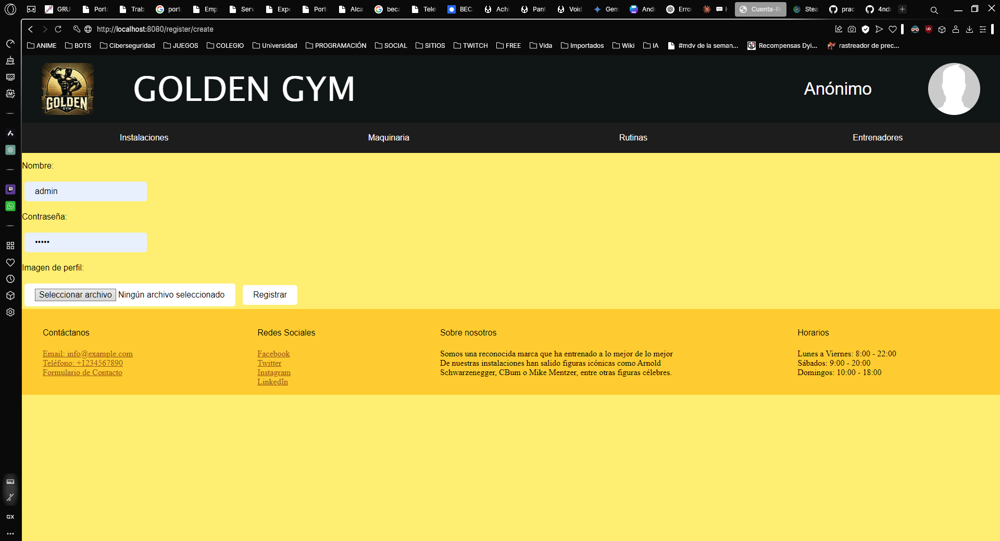
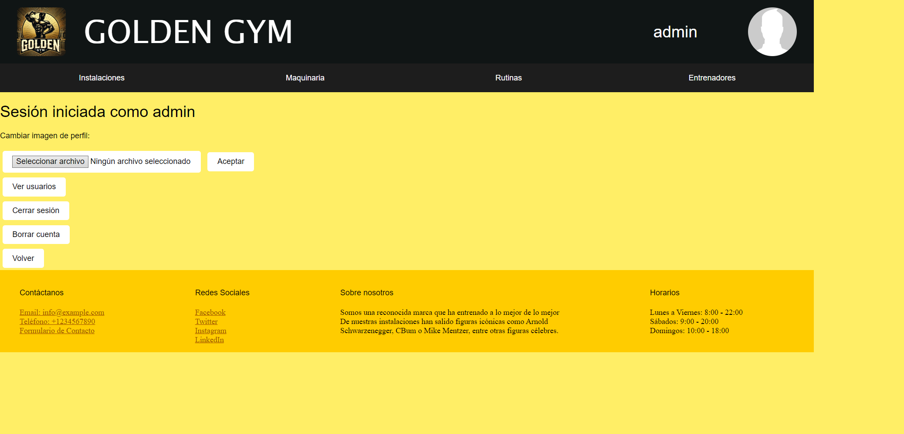

# Nombre de la aplicación: GoldenGym 🏋️


## Integrantes: 
| Name | Email | Github |
|-----------|-----------|-----------|
| Iván Fernández Ruiz    | i.fernandezru.2022@alumnos.urjc.es |[Iván-Fernández](https://github.com/ifernandezru22) |             |
| Sergio Antón Berenguer | s.anton.2022@alumnos.urjc.es | [Sergio-Antón](https://github.com/AnthonyZY13)                             |
| Andrés Korotkov Vorobey       | a.korotkov.2022@alumnos.urjc.es | [Andrés-korotkov](https://github.com/4ndresito3)              |
| Jesús Pérez Madera | j.perezm.2022@alumnos.urjc.es | [Jesús-Pérez](https://github.com/JPM1919)                             |

## Aspectos principales:
- **Entidades:** user, trainer, comment, routine, exercise, material.

   

- **Permisos de usuario:**
  - Usuario registrado: cerrar sesión, borrar cuenta, cambiar imagen de perfil, ver entrenadores, elegir entrenador, ver comentarios del entrenador, comentar entrenador, crear rutina, ver rutina, ver maquinaria, ver instalaciones.
  - Usuario no registrado: iniciar sesión, ver entrenadores, ver comentarios, ver maquinaria, ver instalaciones.
  - Administrador: permisos de usuario registrado + añadir entrenador, eliminar entrenador, añadir maquinaria y añadir ejercicios.
- **Imágenes:** foto de perfil, fotos de entrenadores y de instalaciones.


- ## Capturas de pantalla: 

A continuación, se muestra un recorrido por la página web con las principales páginas accesibles.
- **Página de Inicio:**
 

**Descripción**: Es la primera pantalla que ve el usuario al entrar en la página web. Desde esta pantalla puedes acceder a: Instalaciones, Maquinaria, Rutinas y Entrenadores. Además, puedes acceder a tu perfil pulsando en la foto de perfil. 

- **Pantalla registro de usuarios:**

 

**Descripción**:Para registrarse debes elegir un nombre, contraseña y una foto de perfil (opcional).

- **Página de tu Perfil:**

 

**Descripción**: En la página del perfil del usuario, se presenta las siguientes funcionalidades: Añadir/Cambiar foto de perfil, cerrar sesión, borrar cuenta y ver usuarios (si eres el administrador).

- **Página de Instalaciones:**

 

**Descripción**: Esta página muestra las diferentes localizaciones en las que se encuentran los gimnasios con información relacionada a cada una de ellas.

- **Página de Maquinaria:**

 

**Descripción**:Esta página muestra todas las maquinarias disponibles. Si eres administrador, puedes crear y borrar maquinaria.

- **Página de Rutinas:**

 

**Descripción**:En esta página tienes la opción de crear y ver tus rutinas creadas. Si eres administrador, tienes la posibilidad de crear y eliminar ejercicios.

- **Página de Entrenadores:**

 

**Descripción**: Esta página muestra todos los entrenadores disponibles. Si eres administrador, puedes añadir nuevos entrenadores.

- **Página del perfil de un entrenador:**

 

**Descripción**: Una vez pulsas en alguno de los entrenadores disponibles puedes seleccionarlo como entrenador, ver comentarios sobre la experiencia de otras personas con dicho entrenador (y añadir un comentario si has iniciado sesión).

## Diagrama de navegación: 
- **<span style="color:blue">Azul</span>:** Todos los usuarios.
- **<span style="color:yellow">Amarillo</span>:** Usuarios Registrados y administrador.
- **<span style="color:green">Verde</span>:** Administrador.
- **Nota**: Se puede llegar a index,account, machinery, facilities,routines y trainers desde cualquier página. Tambíen puedes llegar a la página de error desde cualquier página.
 

## Diagrama con las entidades de la base de datos: 
 

## Diagrama de clases y templates: 
 


## Participación parte 1
- **<span style="color:green">Jesús Pérez Madera</span>:** 
    - Tareas: creación de clase usuario, tipos de usuario: usuario anónimo, registrado y administrador, registro e inicio de sesión de usuarios, datos de sesión, foto de perfil, borrar cuenta, ver entrenadores, crear y borrar entrenadores, asignar entrenador a usuario, creación de todos los ficheros html relacionados.
    - 5 commits más significativos:
      - [Commit 1](https://github.com/SSDD-2025/practica-sistemas-distribuidos-2025-grupo-8/commit/ddb328f66a0b82cb62ea27a3d75131b7d790901a)
      - [Commit 2](https://github.com/SSDD-2025/practica-sistemas-distribuidos-2025-grupo-8/commit/e23c3ade23a1c499a4db317ffa583dd88390edb1)
      - [Commit 3](https://github.com/SSDD-2025/practica-sistemas-distribuidos-2025-grupo-8/commit/8cd1e25f323ce90b3cc5067d5371d4b075d23e97)
      - [Commit 4](https://github.com/SSDD-2025/practica-sistemas-distribuidos-2025-grupo-8/commit/e64c8598e3e85d0a4b4ba3c7ebedc5d42cffcd84)
      - [Commit 5](https://github.com/SSDD-2025/practica-sistemas-distribuidos-2025-grupo-8/commit/82732d9953e0a03938ec73b5fde80baa4b334bc8)
    - 5 ficheros en los que se ha participado:
      - [UserController](https://github.com/SSDD-2025/practica-sistemas-distribuidos-2025-grupo-8/blob/main/gymapp/src/main/java/es/codeurjc/gymapp/controllers/UserController.java)
      - [TrainerController](https://github.com/SSDD-2025/practica-sistemas-distribuidos-2025-grupo-8/blob/main/gymapp/src/main/java/es/codeurjc/gymapp/controllers/TrainerController.java)
      - [GlobalControllerAdvice](https://github.com/SSDD-2025/practica-sistemas-distribuidos-2025-grupo-8/blob/main/gymapp/src/main/java/es/codeurjc/gymapp/GlobalControllerAdvice.java)
      - [User](https://github.com/SSDD-2025/practica-sistemas-distribuidos-2025-grupo-8/blob/main/gymapp/src/main/java/es/codeurjc/gymapp/model/User.java)
      - [UserSession](https://github.com/SSDD-2025/practica-sistemas-distribuidos-2025-grupo-8/blob/main/gymapp/src/main/java/es/codeurjc/gymapp/model/UserSession.java)
- **<span style="color:green">Sergio Antón </span>:** 
    - Tareas: gestión de rutinas (crear, borrar y modificar), trabajo en el routineController,en el routineServices y en la entidad rutina, pequeñas aportaciones al css, refactorización de código, creación de los ficheros html relacionados con las rutinas y con su gestión.
    - 5 commits más significativos:
      - [Commit 1](https://github.com/SSDD-2025/practica-sistemas-distribuidos-2025-grupo-8/commit/ce2ed89ad2ab75850f79414000222cf3ce1f16ba)
      - [Commit 2](https://github.com/SSDD-2025/practica-sistemas-distribuidos-2025-grupo-8/commit/6970a67bb99ae4ed7cd8995f08dd82d21f9f6a83)
      - [Commit 3](https://github.com/SSDD-2025/practica-sistemas-distribuidos-2025-grupo-8/commit/3699889086afa79d04573d241e0c949c60be8b9b)
      - [Commit 4](https://github.com/SSDD-2025/practica-sistemas-distribuidos-2025-grupo-8/commit/783765d6035a637ae58234469e856a6c5d384ff0)
      - [Commit 5](https://github.com/SSDD-2025/practica-sistemas-distribuidos-2025-grupo-8/commit/b7a063c12fa434deef75b486f3430601a9e06bc2)
    - 5 ficheros en los que se ha participado:
      - [RoutineController](https://github.com/SSDD-2025/practica-sistemas-distribuidos-2025-grupo-8/blob/main/gymapp/src/main/java/es/codeurjc/gymapp/controllers/RoutineController.java)
      - [Routine](https://github.com/SSDD-2025/practica-sistemas-distribuidos-2025-grupo-8/blob/main/gymapp/src/main/java/es/codeurjc/gymapp/model/Routine.java)
      - [RoutineService](https://github.com/SSDD-2025/practica-sistemas-distribuidos-2025-grupo-8/blob/main/gymapp/src/main/java/es/codeurjc/gymapp/services/RoutineServices.java)
      - [Routine.htmls](https://github.com/SSDD-2025/practica-sistemas-distribuidos-2025-grupo-8/tree/main/gymapp/src/main/resources/templates/routines)
      - [AdminController](https://github.com/SSDD-2025/practica-sistemas-distribuidos-2025-grupo-8/blame/main/gymapp/src/main/resources/static/style.css)
- **<span style="color:green">Iván Fernández Ruiz</span>:** 
    - Tareas: creación de funcionalidad de maquinaria (ver, añadir y eliminar), ejercicios (añadir y eliminar) y comentarios de los entrenadores (ver, añadir y eliminar) creación de los htmls asociados a las funcionalidades anteriores, solución de errores relacionados con la comprobación de campos en los formularios (crear rutina, modificar rutina, entre otros) y solución de errores de borrado de usuarios cuando el usuario tiene rutinas y comentarios asociados.
    - 5 commits más significativos:
      - [Commit 1](https://github.com/SSDD-2025/practica-sistemas-distribuidos-2025-grupo-8/commit/174c8636125cdbce22e5095e4911fe37e082c93c)
      - [Commit 2](https://github.com/SSDD-2025/practica-sistemas-distribuidos-2025-grupo-8/commit/59973cb9b60f6bf2f57e2e13b825ae3b9f398154)
      - [Commit 3](https://github.com/SSDD-2025/practica-sistemas-distribuidos-2025-grupo-8/commit/74dac0bb697484876c81afa7569dec7a79a89fd2)
      - [Commit 4](https://github.com/SSDD-2025/practica-sistemas-distribuidos-2025-grupo-8/commit/e281bd808904238967df174b496fb924402da765)
      - [Commit 5](https://github.com/SSDD-2025/practica-sistemas-distribuidos-2025-grupo-8/commit/6ae3cd17c616fdf8e58604e890e016d9dd80d036)
    - 5 ficheros en los que se ha participado:
      - [ExerciseServices](https://github.com/SSDD-2025/practica-sistemas-distribuidos-2025-grupo-8/blob/main/gymapp/src/main/java/es/codeurjc/gymapp/services/ExerciseServices.java)
      - [CommentService](https://github.com/SSDD-2025/practica-sistemas-distribuidos-2025-grupo-8/blob/main/gymapp/src/main/java/es/codeurjc/gymapp/services/CommentService.java)
      - [MaterialController](https://github.com/SSDD-2025/practica-sistemas-distribuidos-2025-grupo-8/blob/main/gymapp/src/main/java/es/codeurjc/gymapp/controllers/MaterialController.java)
      - [ExerciseController](https://github.com/SSDD-2025/practica-sistemas-distribuidos-2025-grupo-8/blob/main/gymapp/src/main/java/es/codeurjc/gymapp/controllers/ExerciseController.java)
      - [TrainerController](https://github.com/SSDD-2025/practica-sistemas-distribuidos-2025-grupo-8/blob/main/gymapp/src/main/java/es/codeurjc/gymapp/controllers/TrainerController.java)
      
- **<span style="color:green">Andrés Korotkov Vorobey</span>:**
   - Tareas: creacion de la funcionalidad de la clase material, aportaciones pequeñas al RoutineController, refactorizacion de codigo y lógica de negocio, creación y modificacion del archivo css, creacion y/o modificacion de plantillas common y estáticas como index y facilities ademas de la plantilla error, organización de templates en sus respectivas carpetas y añadidas imagenes a la entidad entrenador junto con entrenadores cargados de base
   - 5 commits más significativos:
      - [Commit 1](https://github.com/SSDD-2025/practica-sistemas-distribuidos-2025-grupo-8/commit/b7b084e2cb885e0be6014af0ef4e5a30da62ef46)
      - [Commit 2](https://github.com/SSDD-2025/practica-sistemas-distribuidos-2025-grupo-8/commit/aa8da6c830fc1e361d68b2d5ba73bf45dbf16d20)
      - [Commit 3](https://github.com/SSDD-2025/practica-sistemas-distribuidos-2025-grupo-8/commit/c08ff5365372971a4c57abe2e3a15c9322649388)
      - [Commit 4](https://github.com/SSDD-2025/practica-sistemas-distribuidos-2025-grupo-8/commit/c676615f0ed42975c9259b91aafc779705d39607)
      - [Commit 5](https://github.com/SSDD-2025/practica-sistemas-distribuidos-2025-grupo-8/commit/9626a7e07489c13ba21d41ef80fd0a1f6b9cc9d3)
   - 5 ficheros en los que se ha participado:
      - [Trainer](https://github.com/SSDD-2025/practica-sistemas-distribuidos-2025-grupo-8/blob/main/gymapp/src/main/java/es/codeurjc/gymapp/model/Trainer.java)
      - [Material](https://github.com/SSDD-2025/practica-sistemas-distribuidos-2025-grupo-8/blob/main/gymapp/src/main/java/es/codeurjc/gymapp/model/Material.java)
      - [Error](https://github.com/SSDD-2025/practica-sistemas-distribuidos-2025-grupo-8/blob/main/gymapp/src/main/resources/templates/error.html)
      - [Header & Footer](https://github.com/SSDD-2025/practica-sistemas-distribuidos-2025-grupo-8/tree/main/gymapp/src/main/resources/templates/common)
      - [TrainerDetails.html](https://github.com/SSDD-2025/practica-sistemas-distribuidos-2025-grupo-8/blob/main/gymapp/src/main/resources/templates/trainers/trainerDetails.html)

## Participación parte 2
- **<span style="color:green">Jesús Pérez Madera</span>:** 
    - Tareas: implementación de seguridad(comunicación cifrada por https, autenticación de usuarios, autorización de acceso, roles en la aplicación, usuarios en la base de datos, protección con CSRF y autenticación con tokens para gestionar usuarios en la API REST), paginación web con consultas AJAX a la API REST.
    - 5 commits más significativos:
      - [Commit 1](https://github.com/SSDD-2025/practica-sistemas-distribuidos-2025-grupo-8/commit/6b3f3b63e0b7cbe392043816e83b0fe22140dad7)
      - [Commit 2](https://github.com/SSDD-2025/practica-sistemas-distribuidos-2025-grupo-8/commit/b178a3e7111534162119a45d9ff93fd722f47583)
      - [Commit 3](https://github.com/SSDD-2025/practica-sistemas-distribuidos-2025-grupo-8/commit/f131fd27819599ac35f794b15b70aec5759320fb)
      - [Commit 4](https://github.com/SSDD-2025/practica-sistemas-distribuidos-2025-grupo-8/commit/e64c8598e3e85d0a4b4ba3c7ebedc5d42cffcd84)
      - [Commit 5](https://github.com/SSDD-2025/practica-sistemas-distribuidos-2025-grupo-8/commit/727f5d368f6a233be1246419b5f176dfca7b7933)
    - 5 ficheros en los que se ha participado:
      - [SecurityConfiguration](https://github.com/SSDD-2025/practica-sistemas-distribuidos-2025-grupo-8/blob/main/gymapp/src/main/java/es/codeurjc/gymapp/security/SecurityConfiguration.java)
      - [UserSession](https://github.com/SSDD-2025/practica-sistemas-distribuidos-2025-grupo-8/blob/main/gymapp/src/main/java/es/codeurjc/gymapp/model/UserSession.java)
      - [CSRF](https://github.com/SSDD-2025/practica-sistemas-distribuidos-2025-grupo-8/tree/main/gymapp/src/main/java/es/codeurjc/gymapp/CSRF)
      - [JWT](https://github.com/SSDD-2025/practica-sistemas-distribuidos-2025-grupo-8/tree/main/gymapp/src/main/java/es/codeurjc/gymapp/security/jwt)
      - [show_users](https://github.com/SSDD-2025/practica-sistemas-distribuidos-2025-grupo-8/blob/main/gymapp/src/main/resources/templates/account/show_users.html)
- **<span style="color:green">Sergio Antón </span>:** //POR HACER
    - Tareas: gestión de rutinas (crear, borrar y modificar), trabajo en el routineController,en el routineServices y en la entidad rutina, pequeñas aportaciones al css, refactorización de código, creación de los ficheros html relacionados con las rutinas y con su gestión.
    - 5 commits más significativos:
      - [Commit 1](https://github.com/SSDD-2025/practica-sistemas-distribuidos-2025-grupo-8/commit/ce2ed89ad2ab75850f79414000222cf3ce1f16ba)
      - [Commit 2](https://github.com/SSDD-2025/practica-sistemas-distribuidos-2025-grupo-8/commit/6970a67bb99ae4ed7cd8995f08dd82d21f9f6a83)
      - [Commit 3](https://github.com/SSDD-2025/practica-sistemas-distribuidos-2025-grupo-8/commit/3699889086afa79d04573d241e0c949c60be8b9b)
      - [Commit 4](https://github.com/SSDD-2025/practica-sistemas-distribuidos-2025-grupo-8/commit/783765d6035a637ae58234469e856a6c5d384ff0)
      - [Commit 5](https://github.com/SSDD-2025/practica-sistemas-distribuidos-2025-grupo-8/commit/b7a063c12fa434deef75b486f3430601a9e06bc2)
    - 5 ficheros en los que se ha participado:
      - [RoutineController](https://github.com/SSDD-2025/practica-sistemas-distribuidos-2025-grupo-8/blob/main/gymapp/src/main/java/es/codeurjc/gymapp/controllers/RoutineController.java)
      - [Routine](https://github.com/SSDD-2025/practica-sistemas-distribuidos-2025-grupo-8/blob/main/gymapp/src/main/java/es/codeurjc/gymapp/model/Routine.java)
      - [RoutineService](https://github.com/SSDD-2025/practica-sistemas-distribuidos-2025-grupo-8/blob/main/gymapp/src/main/java/es/codeurjc/gymapp/services/RoutineServices.java)
      - [Routine.htmls](https://github.com/SSDD-2025/practica-sistemas-distribuidos-2025-grupo-8/tree/main/gymapp/src/main/resources/templates/routines)
      - [AdminController](https://github.com/SSDD-2025/practica-sistemas-distribuidos-2025-grupo-8/blame/main/gymapp/src/main/resources/static/style.css)
- **<span style="color:green">Iván Fernández Ruiz</span>:** //POR HACER
    - Tareas: creación de funcionalidad de maquinaria (ver, añadir y eliminar), ejercicios (añadir y eliminar) y comentarios de los entrenadores (ver, añadir y eliminar) creación de los htmls asociados a las funcionalidades anteriores, solución de errores relacionados con la comprobación de campos en los formularios (crear rutina, modificar rutina, entre otros) y solución de errores de borrado de usuarios cuando el usuario tiene rutinas y comentarios asociados.
    - 5 commits más significativos:
      - [Commit 1](https://github.com/SSDD-2025/practica-sistemas-distribuidos-2025-grupo-8/commit/174c8636125cdbce22e5095e4911fe37e082c93c)
      - [Commit 2](https://github.com/SSDD-2025/practica-sistemas-distribuidos-2025-grupo-8/commit/59973cb9b60f6bf2f57e2e13b825ae3b9f398154)
      - [Commit 3](https://github.com/SSDD-2025/practica-sistemas-distribuidos-2025-grupo-8/commit/74dac0bb697484876c81afa7569dec7a79a89fd2)
      - [Commit 4](https://github.com/SSDD-2025/practica-sistemas-distribuidos-2025-grupo-8/commit/e281bd808904238967df174b496fb924402da765)
      - [Commit 5](https://github.com/SSDD-2025/practica-sistemas-distribuidos-2025-grupo-8/commit/6ae3cd17c616fdf8e58604e890e016d9dd80d036)
    - 5 ficheros en los que se ha participado:
      - [ExerciseServices](https://github.com/SSDD-2025/practica-sistemas-distribuidos-2025-grupo-8/blob/main/gymapp/src/main/java/es/codeurjc/gymapp/services/ExerciseServices.java)
      - [CommentService](https://github.com/SSDD-2025/practica-sistemas-distribuidos-2025-grupo-8/blob/main/gymapp/src/main/java/es/codeurjc/gymapp/services/CommentService.java)
      - [MaterialController](https://github.com/SSDD-2025/practica-sistemas-distribuidos-2025-grupo-8/blob/main/gymapp/src/main/java/es/codeurjc/gymapp/controllers/MaterialController.java)
      - [ExerciseController](https://github.com/SSDD-2025/practica-sistemas-distribuidos-2025-grupo-8/blob/main/gymapp/src/main/java/es/codeurjc/gymapp/controllers/ExerciseController.java)
      - [TrainerController](https://github.com/SSDD-2025/practica-sistemas-distribuidos-2025-grupo-8/blob/main/gymapp/src/main/java/es/codeurjc/gymapp/controllers/TrainerController.java)
      
- **<span style="color:green">Andrés Korotkov Vorobey</span>:**
   - Tareas: creación e implementación de las api rest de usuarios y trainers, junto con la colección de postman para todas las peticiones, creación de la mayoría de los DTO's para las entidades junto con las refactorizaciones necesarias y convenientes del cambio de entidades por sus DTO's en los controladores WEB, además de un método para juntar varios records.
   - 5 commits más significativos:
      - [Commit 1](https://github.com/SSDD-2025/practica-sistemas-distribuidos-2025-grupo-8/commit/88c2b03a60ed54671824658dc0b66723c859e0b5)
      - [Commit 2](https://github.com/SSDD-2025/practica-sistemas-distribuidos-2025-grupo-8/commit/485d56073a95062a81024adbba6a7e0f0e0582c2)
      - [Commit 3](https://github.com/SSDD-2025/practica-sistemas-distribuidos-2025-grupo-8/commit/6ccb57e66d1310dbeb24b8a8e98c96a10f013004)
      - [Commit 4](https://github.com/SSDD-2025/practica-sistemas-distribuidos-2025-grupo-8/commit/d6fd3f6a9a19f563ad66a3abdd4b9f7aaa1a9b08)
      - [Commit 5](https://github.com/SSDD-2025/practica-sistemas-distribuidos-2025-grupo-8/commit/e4801514a9421544cbde3afc8c397c364532940d)
   - 5 ficheros en los que se ha participado:
      - [TrainerRESTController](https://github.com/SSDD-2025/practica-sistemas-distribuidos-2025-grupo-8/blob/main/gymapp/src/main/java/es/codeurjc/gymapp/controllers/REST/TrainerRESTController.java)
      - [UserRESTController](https://github.com/SSDD-2025/practica-sistemas-distribuidos-2025-grupo-8/blob/main/gymapp/src/main/java/es/codeurjc/gymapp/controllers/REST/UserRESTController.java)
      - [Most DTO's](https://github.com/SSDD-2025/practica-sistemas-distribuidos-2025-grupo-8/tree/main/gymapp/src/main/java/es/codeurjc/gymapp/DTO)
      - [PostMan collection](https://github.com/SSDD-2025/practica-sistemas-distribuidos-2025-grupo-8/blob/main/GymApp.postman_collection.json)
      - [DTOServices](https://github.com/SSDD-2025/practica-sistemas-distribuidos-2025-grupo-8/blob/main/gymapp/src/main/java/es/codeurjc/gymapp/services/DTOServices.java)

## Instrucciones de ejecución

1. Descarga este repositorio y descomprímelo
2. Descarga MySQL workBench 
3. usuario: root contraseña: 123456789 puerto:3306
4. Crea un esquema que se llame gymapp 
  
      ```sql
      CREATE SCHEMA gymapp;
      ```
5. Run Application en VS 
6. Ve https://localhost/8443/

### Se necesita
- Java: JDK 21 
    - Windows: https://www.oracle.com/java/technologies/javase/jdk21-archive-downloads.html
    - Linux:  escribe en la terminal
        ```shell
        sudo apt install openjdk-21
        ```

- MySQL: v.8.0.33.0
    - Windows: https://dev.mysql.com/downloads/
    - Linux: escribe en la terminal
        ```shell
        sudo apt install mysql-server=8.0.33
        ```

- Maven: 4.0.0
    - Windows: https://maven.apache.org/download.cgi
- Spring Boot 3.4.2
- VisualStudioCode + SpringBoot
